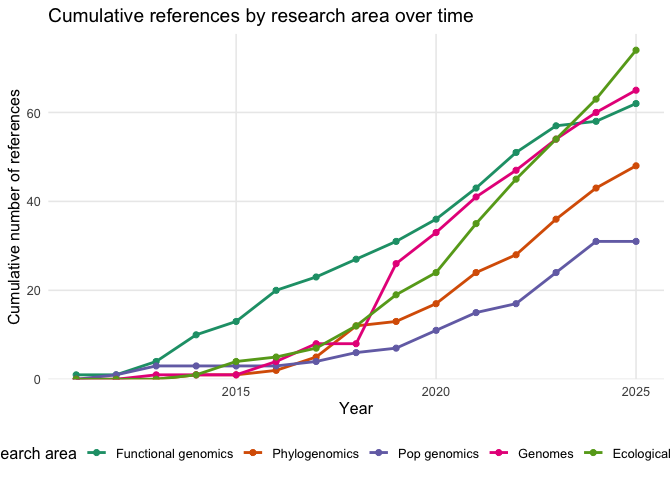
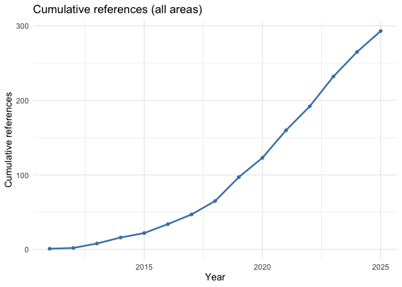
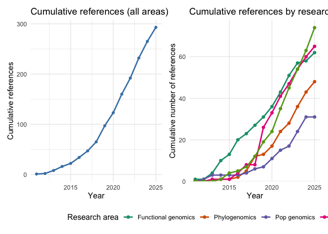
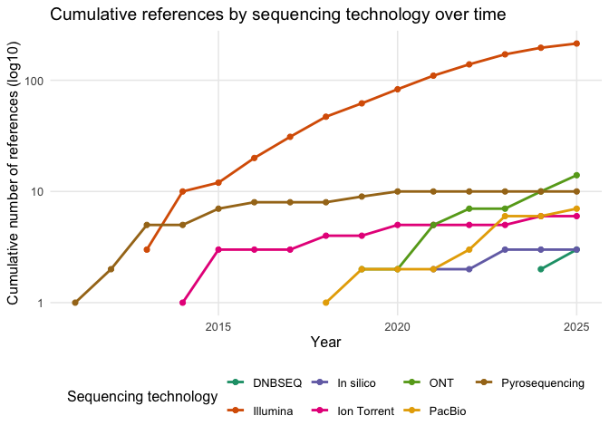
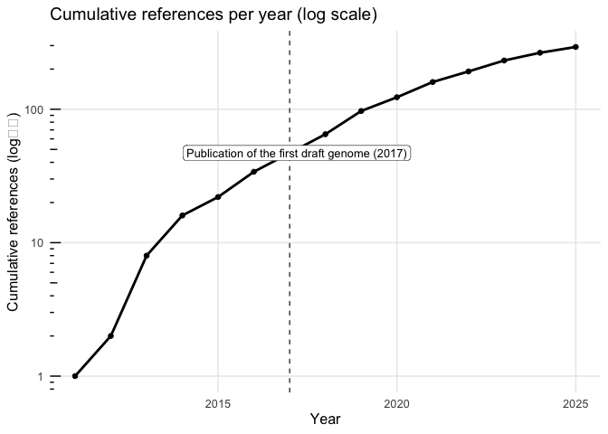
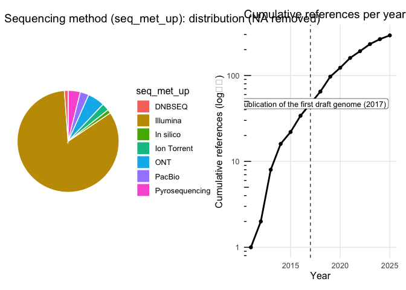

# Plots and tables from Literature reference search with Scopus on HTS in spider research

## 1. Accumulative number of reference through years by research area (Category)


We will first load data, which is located in the ../data/raw/ subfolder.  I have the relevant informatiom in columns: year, category


``` r
refs <- read_csv ("../data/raw/Scopus_references_HTSspiders.csv",
                 show_col_types = FALSE)
refs <- refs[-nrow(refs), ]
write_csv(refs,"../data/processed/Scopus_references_HTSspiders_293.csv")
```

Optional: enforce your 6 groups + order (edit if names differ)

``` r
group_levels <- c("Functional genomics",
                  "Phylogenomics",
                  "Pop genomics",
                  "Genomes",
                  "Biodiversity assessment",
                  "Ecological interactions")
refs <- refs %>%
  mutate(Category = factor(Category, levels = group_levels))
```

Prepare cumulative counts per group-year

1. count references per (year, group)


``` r
counts <- refs %>%
  count(Year, Category, name = "n")
```

2. ensure every (Year, Category) exists (fill missing with 0)

``` r
year_range <- range(counts$Year, na.rm = TRUE)
all_years <- seq(year_range[1], year_range[2])
counts_complete <- counts %>%
  group_by(Category) %>%
  tidyr::complete(Year = all_years, fill = list(n = 0)) %>%
  ungroup()
```

3. cumulative sum by group over years


``` r
cum_counts <- counts_complete %>%
  arrange(Category, Year) %>%
  group_by(Category) %>%
  mutate(cum_n = cumsum(n)) %>%
  ungroup()
```

Plot: cumulative lines per group


``` r
p_category <- ggplot(cum_counts, aes(x = Year, y = cum_n, color = Category)) +
  geom_line(linewidth = 1) +
  geom_point(size = 1.8) +
  scale_x_continuous(breaks = scales::pretty_breaks()) +
  scale_y_continuous(expand = expansion(mult = c(0, .05))) +
  scale_color_brewer(palette = "Dark2", na.translate = FALSE) +
  labs(
    title = "Cumulative references by research area over time",
    x = "Year",
    y = "Cumulative number of references",
    color = "Research area"
  ) +
  theme_minimal(base_size = 12) +
  theme(
    panel.grid.minor = element_blank(),
    legend.position = "bottom"
  )

ggsave("../figures/p_category.pdf", plot = p_category, width = 8, height = 5)
```

```
## Warning: Removed 15 rows containing missing values or values outside the scale range
## (`geom_line()`).
```

```
## Warning: Removed 15 rows containing missing values or values outside the scale range
## (`geom_point()`).
```

``` r
print(p_category)
```

```
## Warning: Removed 15 rows containing missing values or values outside the scale range
## (`geom_line()`).
## Removed 15 rows containing missing values or values outside the scale range
## (`geom_point()`).
```

<!-- -->


## 2. Cumulative counts overall (all groups combined)


``` r
counts_total <- refs %>%
  count(Year, name = "n") %>%
  arrange(Year) %>%
  mutate(cum_n = cumsum(n))
```


``` r
p_total <- ggplot(counts_total, aes(x = Year, y = cum_n)) +
  geom_line(color = "steelblue", linewidth = 1) +
  geom_point(color = "steelblue", size = 1.5) +
  scale_x_continuous(breaks = scales::pretty_breaks()) +
  labs(
    title = "Cumulative references (all areas)",
    x = "Year", y = "Cumulative references"
  ) +
  theme_minimal(base_size = 12)

ggsave("../figures/p_total.pdf", plot = p_total, width = 8, height = 5)

print(p_total)
```

<!-- -->

# ---- 3) combine side by side ----


``` r
combined <- p_total + p_category  # patchwork puts them side by side by default
ggsave("../figures/combined.pdf", plot = combined, width = 8, height = 5)
```

```
## Warning: Removed 15 rows containing missing values or values outside the scale range
## (`geom_line()`).
```

```
## Warning: Removed 15 rows containing missing values or values outside the scale range
## (`geom_point()`).
```

``` r
print(combined)
```

```
## Warning: Removed 15 rows containing missing values or values outside the scale range
## (`geom_line()`).
## Removed 15 rows containing missing values or values outside the scale range
## (`geom_point()`).
```

<!-- -->
## 4. Plot by sequencing method 

Optional: enforce your 7 groups + order (edit if names differ)

``` r
group_levels_seq <- c("DNBSEQ",
                  "Illumina",
                  "In silico",
                  "Ion Torrent",
                  "ONT",
                  "PacBio",
                  "Pyrosequencing")
refs <- refs %>%
  mutate(seq_met_up = factor(seq_met_up, levels = group_levels_seq))
```

Prepare cumulative counts per group-year

1. count references per (year, group)


``` r
counts_seq <- refs %>%
  count(Year, seq_met_up, name = "n")
```

2. ensure every (Year, Category) exists (fill missing with 0)

``` r
year_range <- range(counts_seq$Year, na.rm = TRUE)
all_years <- seq(year_range[1], year_range[2])
counts_seq_complete <- counts_seq %>%
  group_by(seq_met_up) %>%
  tidyr::complete(Year = all_years, fill = list(n = 0)) %>%
  ungroup()
```


3. cumulative sum by group over years


``` r
cum_counts_seq <- counts_seq_complete %>%
  arrange(seq_met_up, Year) %>%
  group_by(seq_met_up) %>%
  mutate(cum_n = cumsum(n)) %>%
  ungroup()
```

4. Log scale cannot display zero, so drop years before first nonzero cumulative


``` r
cum_counts_seq_0 <- cum_counts_seq %>% filter(cum_n > 0)
```

Plot: cumulative lines per group


``` r
p_group_seq <- ggplot(cum_counts_seq_0, aes(x = Year, y = cum_n, color = seq_met_up)) +
  geom_line(linewidth = 1) +
  geom_point(size = 1.8) +
  scale_x_continuous(breaks = scales::pretty_breaks()) +
  scale_y_log10(
    labels = scales::label_number(accuracy = 1),
    breaks = scales::log_breaks()
  )+
  scale_color_brewer(palette = "Dark2", na.translate = FALSE) +
  labs(
    title = "Cumulative references by sequencing technology over time",
    x = "Year",
    y = "Cumulative number of references (log10)",
    color = "Sequencing technology"
  ) +
  theme_minimal(base_size = 12) +
  theme(
    panel.grid.minor = element_blank(),
    legend.position = "bottom"
  )

ggsave("../figures/p_group_seq.pdf", plot = p_group_seq, width = 8, height = 5)
```

```
## Warning: Removed 10 rows containing missing values or values outside the scale range
## (`geom_line()`).
```

```
## Warning: Removed 10 rows containing missing values or values outside the scale range
## (`geom_point()`).
```

``` r
print(p_group_seq)
```

```
## Warning: Removed 10 rows containing missing values or values outside the scale range
## (`geom_line()`).
## Removed 10 rows containing missing values or values outside the scale range
## (`geom_point()`).
```

<!-- -->


FROM HERE DOWN NOT CHECKED

## Building a pie chart of sequencing techniques

Build the pie data


``` r
set.seed(123)  # for stable ggrepel placement

pie_df <- refs %>%
  filter(!is.na(seq_met_up), seq_met_up != "") %>%
  count(seq_met_up, name = "n") %>%
  # lock levels to size-descending order so stacking & labels match
  mutate(seq_met_up = fct_reorder(seq_met_up, n, .desc = TRUE)) %>%
  arrange(seq_met_up) %>%
  mutate(
    total = sum(n),
    prop  = n / total,
    cum   = cumsum(prop),
    mid   = cum - prop/2,                         # midpoint angle (as proportion 0..1)
    lab   = paste0(as.character(seq_met_up), " (", round(prop*100, 1), "%)")
  )
```

Draw the pie and labels OUTSIDE (plain geom_text first)


``` r
lab_text <- sprintf("%s (%.1f%%)", pie_df$seq_met_up, 100 * pie_df$n / sum(pie_df$n))

p_pie <- ggplot(pie_df, aes(x = 1, y = n, fill = seq_met_up)) +
  geom_col(width = 1, color = "white") +
  coord_polar(theta = "y", start = pi/2, clip = "off") +
  # expand radial space to accommodate labels farther out
  xlim(0.3, 2.5) +
  # leader lines: from slice edge (x ~ 1.0) to just inside the labels (xend ~ 1.7)
  geom_segment(
    aes(x = 1.0, xend = 1.8),
    y = 0, yend = 0,
    position = position_stack(vjust = 0.5),
    linewidth = 0.35,
    colour = "grey40",
    show.legend = FALSE
  ) +
  # labels outside: x = 2.0 (adjust outward if you want even more distance)
#  geom_text(
 #   aes(x = 2.2, label = lab_text),
  #  position = position_stack(vjust = 0.5),
   # size = 3.6,
    #show.legend = FALSE
  #) 
  ggrepel::geom_text_repel(
    aes(x = 2.2, label = lab_text),
    position = position_stack(vjust = 0.5),
    size = 3.6,
    show.legend = FALSE
  )+
  theme_void(base_size = 12) +
  theme(
    legend.position = "none",
    plot.margin = margin(10, 90, 10, 10)   # extra margin for labels on the right
  ) +
  labs(title = "Sequencing method (seq_met_up): distribution")

print(p_pie)
```

```
## Warning: Stacking requires either the ymin and ymax or the y aesthetics
## ℹ Maybe you want `position = "identity"`?
```

<!-- -->

``` r
refs_2 <- refs %>%
  mutate(
    year = as.integer(Year)
    # NOTE: do NOT convert NA in seq_met_up to "Unknown" anymore; we want to drop NA
  )
```

 PIE: seq_met_up distribution (NA removed)


``` r
pie_df <- refs_2 %>%
  filter(!is.na(seq_met_up), seq_met_up != "") %>%   # drop NA/empty
  count(seq_met_up, name = "n") %>%
  arrange(desc(n)) %>%
  mutate(pct = n / sum(n),
         lab = paste0(seq_met_up, " (", scales::percent(pct), ")"))
```


``` r
p_pie <- ggplot(pie_df, aes(x = "", y = pct, fill = seq_met_up)) +
  geom_col(width = 1, color = "white") +
  coord_polar(theta = "y") +
  guides(fill = guide_legend(title = "seq_met_up")) +
  labs(title = "Sequencing method (seq_met_up): distribution (NA removed)") +
  theme_void(base_size = 12) +
  theme(legend.position = "right")
```

Count by year and make cumulative, filling missing years


``` r
# 
yrs_counts <- refs_2 %>%
  filter(!is.na(Year)) %>%
  count(Year, name = "n") %>%
  arrange(Year)

if (nrow(yrs_counts) > 0) {
  full_yrs <- tibble(Year = seq(min(yrs_counts$Year), max(yrs_counts$Year)))
  yrs <- full_yrs %>%
    left_join(yrs_counts, by = "Year") %>%
    mutate(n = replace_na(n, 0),
           cum_n = cumsum(n))
} else {
  yrs <- tibble(year = integer(), n = integer(), cum_n = integer())
}
```

milestones (EDIT HERE) 


``` r
milestones <- tibble::tibble(
  year  = c(2017),
  label = c("Publication of the first draft genome")
)

# Map milestone Y to the cumulative at that year
if (nrow(yrs) > 0 && nrow(milestones) > 0) {
  y_at_milestones <- approx(
    x = yrs$Year, y = yrs$cum_n,
    xout = milestones$year,
    method = "constant", rule = 2, f = 1
  )$y
  milestones <- milestones %>% mutate(cum_n = y_at_milestones)
}
```


Log scale cannot display zero, so drop years before first nonzero cumulative


``` r
yrs_plot <- yrs %>% filter(cum_n > 0)

p_cum <- ggplot(yrs_plot, aes(x = Year, y = cum_n)) +
  geom_line(linewidth = 1) +
  geom_point(size = 1.6) +
  # vertical dashed markers
  geom_vline(data = milestones, aes(xintercept = year),
             linetype = "dashed", linewidth = 0.4) +
  # labels, positioned at the milestone cumulative
  geom_label(
    data = milestones,
    aes(x = year, y = pmax(1, cum_n), label = paste0(label, " (", year, ")")),
    label.size = 0.2, size = 3.4, label.r = unit(3, "pt"),
    nudge_x = 0.2
  ) +
  scale_x_continuous(breaks = scales::pretty_breaks()) +
  scale_y_log10(
    labels = scales::label_number(accuracy = 1),
    breaks = scales::log_breaks()
  ) +
  annotation_logticks(sides = "l") +
  labs(
    title = "Cumulative references per year (log scale)",
    x = "Year", y = "Cumulative references (log₁₀)"
  ) +
  theme_minimal(base_size = 12) +
  theme(panel.grid.minor = element_blank())

print (p_cum)
```

<!-- -->

Combine side by side


``` r
combined <- p_pie + p_cum + plot_layout(widths = c(1, 1.2))
print(combined)
```

<!-- -->


